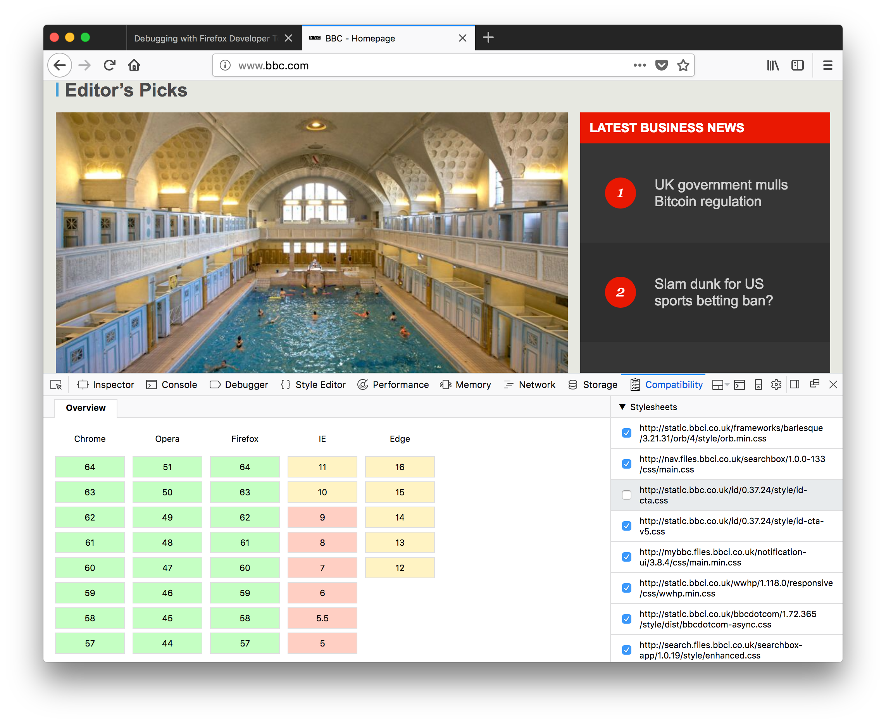

# Compat Report

> A DevTools panel for flagging browser compatibility issues

## Overview

This extension creates a Developer Tools panel that provides a basic overview of potential browser compatibility issues, using data from [MDN](https://github.com/mdn/browser-compat-data). It's still a proof of concept at the moment, so you'll likely find some glitches in the matrix.

## Installation

Compat Report was built using the [WebExtensions](https://developer.mozilla.org/en-US/Add-ons/WebExtensions) standard, so any compatible browser should support it. At this point, it was only tested with **Firefox 57**.

To install it, clone the repository (or [download the ZIP archive](https://github.com/eduardoboucas/compat-report/archive/master.zip)) and follow the instructions on how to [install a temporary add-on](https://developer.mozilla.org/en-US/Add-ons/WebExtensions/Temporary_Installation_in_Firefox).

## Usage

To get a compatibility report, navigate to the page you want to inspect and open the **Compatibility** tab.

